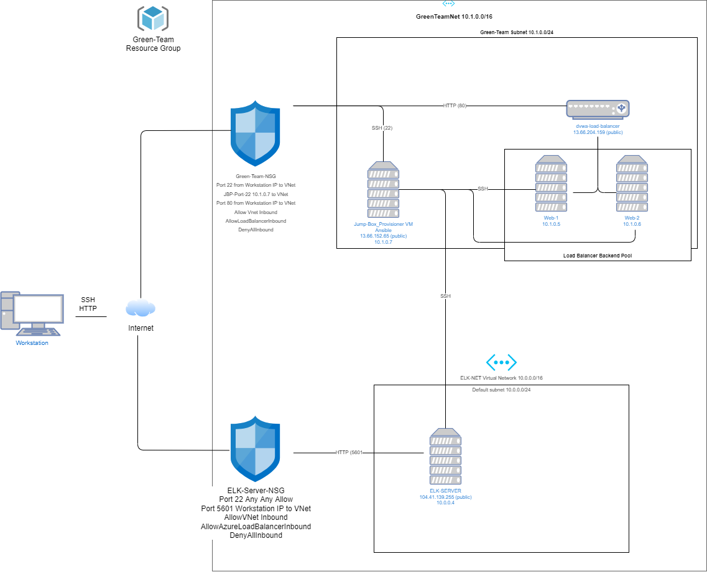

## Automated ELK Stack Deployment

The files in this repository were used to configure the network depicted below.

These files have been tested and used to generate a live ELK deployment on Azure. They can be used to either recreate the entire deployment pictured above. Alternatively, select portions of the _____ file may be used to install only certain pieces of it, such as Filebeat.

  - _Ansible/_

This document contains the following details:
- Description of the Topologu
- Access Policies
- ELK Configuration
  - Beats in Use
  - Machines Being Monitored
- How to Use the Ansible Build

### Description of the Topology

The main purpose of this network is to expose a load-balanced and monitored instance of DVWA, the D*mn Vulnerable Web Application.

Load balancing ensures that the application will be highly reliable, in addition to restricting traffic to the network.

Integrating an ELK server allows users to easily monitor the vulnerable VMs for changes to the logs and system traffic.
- Filebeat monitors log files and specified file system locations
- Metricbeat records statistics from the OS of the server and the services running on it.

The configuration details of each machine may be found below.
_Note: Use the [Markdown Table Generator](http://www.tablesgenerator.com/markdown_tables) to add/remove values from the table_.

| Name     | Function    | IP Address | Operating System |
|----------|-------------|------------|------------------|
| Jump Box | Gateway     |  10.1.0.7  |   Linux          |
| Web-1    | Webserver1  |  10.1.0.5  |   Linux          |   
| Web-2    | Webserver2  |  10.1.0.6  |   Linux          |

### Access Policies

The machines on the internal network are not exposed to the public Internet. 

Only the Jump Box machine can accept connections from the Internet. Access to this machine is only allowed from the following IP addresses:
- 13.66.204.159 (Load Balancer)
- 104.41.139.255 (ELK Server)

Machines within the network can only be accessed by the Jump Box.
- Jump Box IP: 13.66.152.65

A summary of the access policies in place can be found in the table below.

| Name     | Publicly Accessible | Allowed IP Addresses |
|----------|---------------------|----------------------|
| Jump Box |     No              |  13.66.204.159 104.41.139.255    |
| Web-1    |     No              |  13.66.152.65        |
|  Web-2   |     No              |  13.66.152.65        |
|  ELK     |     No              |  13.66.152.65        |

### Elk Configuration

Ansible was used to automate configuration of the ELK machine. No configuration was performed manually, which is advantageous because:
- Ansible allows administrators to automate daily tasks, saving time in the process.

The playbook implements the following tasks:
- Install Docker
- Install python3-pip
- Install Docker python module
- Set vm.max_map_count to 262144
- Download and launch elk container

The following screenshot displays the result of running `docker ps` after successfully configuring the ELK instance.

### Target Machines & Beats
This ELK server is configured to monitor the following machines:
- Web-1 10.1.0.5
- Web-2 10.1.0.6

We have installed the following Beats on these machines:
- Filebeat
- Metricbeat

These Beats allow us to collect the following information from each machine:
- Changes to log files
- OS metrics and statistics
- Resource usage

### Using the Playbook
In order to use the playbook, you will need to have an Ansible control node already configured. Assuming you have such a control node provisioned: 

SSH into the control node and follow the steps below:
- Copy the ansible.cfg file to /etc/ansible.
- Update the ansible.cfg file to include machine, IP, and update the hosts line to include ansible_python_interpreter=/usr/bin/python3 as shown below:
  - [webservers] 10.1.0.7 ansible_python_interpreter=/usr/bin/python3 10.1.0.5 ansible_python_interpreter=/usr/bin/python3 10.0.0.6       -ansible_python_interpreter=/usr/bin/python3
  - [elk] 10.1.0.4 ansible_python_interpreter=/usr/bin/python3
  - Copy install-elk.yml and filebeat-playbook.yml to /etc/ansible
  - Update install-elk.yml and filebeat-playbook.yml to include the machines you want to use the playbooks on
- Run playbook
- Navigate to http://[your.vm.ip]:5601/app/kibana

### Commands
- nano ansible.cfg
- add machine, IP, ansible_python_interpreter=/usr/bin/python3 to the hosts line
- Exit file
- run cp install-elk.yml /etc/ansible while in the folder that contains install-elk.yml

